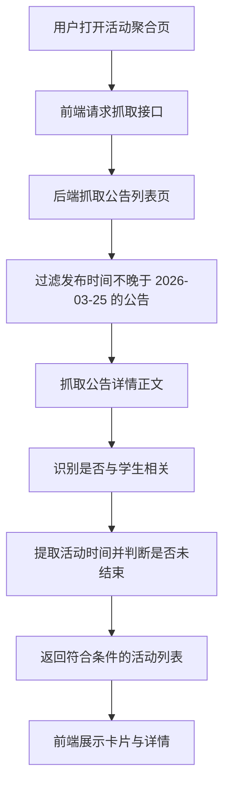

## 1. 产品概述
这是一个面向上海交通大学学生的信息聚合网页，用于抓取并展示通知公告栏目中与学生有关、且在 2026-03-25 这一检验时点仍未结束的活动信息。
- 解决学生需要在大量校级通告中人工筛选活动通知、辨别是否仍可参与的问题。
- 通过统一检索、时间过滤与状态判断，提升学生获知有效活动信息的效率。

## 2. 核心功能

### 2.1 功能模块
1. **活动聚合首页**：展示抓取结果、筛选状态、刷新入口与活动卡片列表。
2. **活动详情查看**：展示活动标题、发布时间、活动时间、状态判断依据、原文链接与正文摘要。

### 2.2 页面详情
| 页面名称 | 模块名称 | 功能描述 |
|-----------|-------------|---------------------|
| 活动聚合首页 | 顶部说明区 | 说明数据来源、检验日期为 2026-03-25、筛选规则与刷新方式 |
| 活动聚合首页 | 统计概览 | 展示抓取总数、通过筛选数量、被排除原因统计 |
| 活动聚合首页 | 活动列表 | 以卡片形式展示标题、发布时间、活动时间、状态标签、学生相关性标签 |
| 活动聚合首页 | 空状态 | 当没有符合条件的活动时给出明确提示 |
| 活动详情查看 | 详情面板 | 展示正文摘要、时间提取结果、判定说明 |
| 活动详情查看 | 原文跳转 | 提供跳转至学校原始公告页面的入口 |

## 3. 核心流程
用户打开网页后，系统向后端请求抓取结果。后端从上海交通大学通知公告页抓取不晚于 2026-03-25 发布的公告列表，再进入详情页识别是否与学生相关，并根据活动截止日期、报名截止日期、举办日期等信息判断该活动在 2026-03-25 是否仍未结束。前端收到结果后，将符合条件的活动清晰展示，并允许用户查看判定依据。

## 4. 用户界面设计
### 4.1 设计风格
- 主色调：深海军蓝、象牙白、少量朱红强调，贴近校园公告与信息服务气质
- 按钮风格：圆角中等、轻微阴影、悬停时有边框高亮
- 字体与字号：标题采用更有书卷感的中文衬线字体，正文采用清晰的中文无衬线字体
- 布局风格：桌面优先的双层信息布局，上方概览，下方卡片列表与详情面板
- 图标风格：线性信息图标，强调通知、时间、链接、筛选状态

### 4.2 页面设计概览
| 页面名称 | 模块名称 | UI 元素 |
|-----------|-------------|-------------|
| 活动聚合首页 | 顶部说明区 | 大标题、时间基准徽标、筛选说明文本、刷新按钮 |
| 活动聚合首页 | 统计概览 | 数字卡片、标签色块、简洁分隔线 |
| 活动聚合首页 | 活动列表 | 多列响应式卡片、状态标签、日期信息、展开详情按钮 |
| 活动详情查看 | 详情面板 | 摘要文本、时间轴、判定说明块、原文链接按钮 |

### 4.3 响应式
采用桌面优先设计，并适配平板与移动端。窄屏下统计区改单列展示，活动卡片纵向堆叠，详情面板改为抽屉或折叠区。
