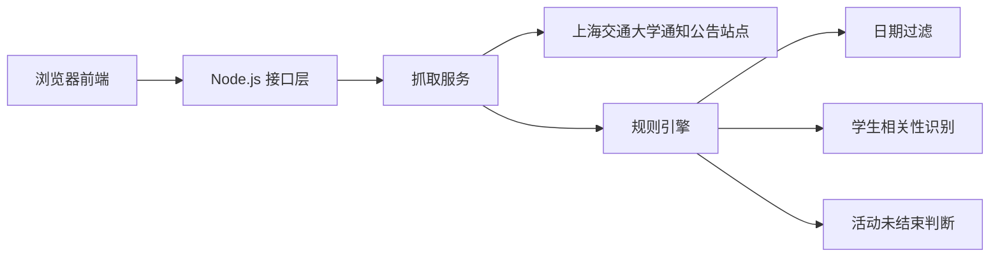
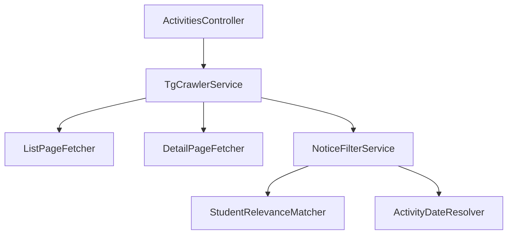
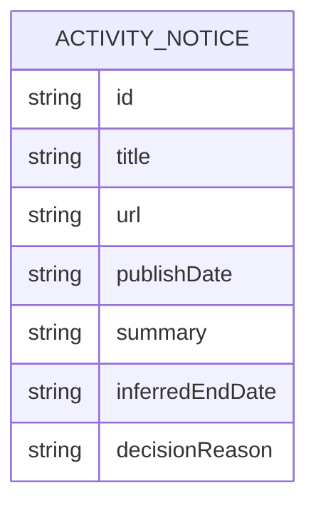

## 1. 架构设计


## 2. 技术描述
- 前端：React@18 + Vite + 原生 CSS
- 初始化工具：Vite
- 后端：Express@4
- 数据存储：无数据库，实时抓取并在内存中完成过滤
- 抓取解析：axios + cheerio
- 时间处理：dayjs

## 3. 路由定义
| 路由 | 用途 |
|-------|---------|
| / | 活动聚合首页 |
| /api/activities | 返回符合条件的活动列表及统计信息 |

## 4. API 定义

```ts
type ActivityItem = {
  id: string;
  title: string;
  url: string;
  publishDate: string;
  matchedKeywords: string[];
  extractedDates: string[];
  inferredEndDate: string | null;
  summary: string;
  status: "ongoing";
  relevanceReason: string;
  decisionReason: string;
};

type ActivitiesResponse = {
  asOfDate: "2026-03-25";
  source: "https://www.sjtu.edu.cn/tg";
  scannedCount: number;
  matchedCount: number;
  items: ActivityItem[];
};
```

## 5. 服务端架构图


## 6. 数据模型
### 6.1 数据模型定义


### 6.2 数据定义说明
- 不建立持久化表，数据模型仅作为接口返回结构。
- 列表抓取阶段获取标题、链接、发布时间。
- 详情抓取阶段提取正文、活动日期、报名截止日期和与学生相关的关键词。
- 过滤规则：
  - 仅保留发布时间小于等于 2026-03-25 的公告。
  - 标题或正文需命中“学生、本科生、研究生、同学、报名、参赛、讲座、活动、征集、招募”等学生活动相关信号。
  - 若正文中提取到活动结束日、报名截止日或最后举办日期，则该日期需大于等于 2026-03-25。
  - 若无法提取结束时间，则默认不展示，避免把已过期活动误判为有效。
